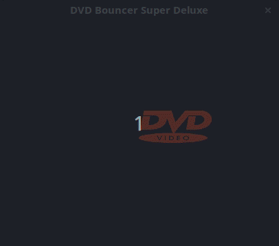

# DVDBounce

Now you can finally have that retro DVD screensaver on your PC.

---



## Installation

### Option One: Download a precompiled release
**You can find all the releases [here](https://github.com/George-lewis/DVDBounce/releases)**

Note, this only applies to you if:

- Your architecture is x64
- You use Windows or Linux

Note: Windows users may need the [Microsoft Visual C++ Redistributable](https://support.microsoft.com/en-ca/help/2977003/the-latest-supported-visual-c-downloads)

### Option Two: Compile

**DVDBounce** is made in C++ with [SFML](https://github.com/SFML/SFML) and [CXXOPTS](https://github.com/jarro2783/cxxopts/) using the package manager [Conan](https://github.com/conan-io/conan) and build tool [CMake](https://cmake.org/), for ease of compilation I recommend acquiring all of these tools.

1. Acquire a C++ compiler (Windows users: I recommend [MSVC](https://visualstudio.microsoft.com/downloads/), Look for "build tools"), Conan, and CMake (Windows users: This comes with the MSVC build tools)
   1. Configure the *bincrafters* repository with Conan: `conan remote add bincrafters https://api.bintray.com/conan/bincrafters/public-conan`
   2. If you don't want to use Conan you'll need to acquire all of the dependencies yourself.
2. Clone the repo
3. Install dependencies
   1. Create a Conan folder in the repo
      1. If you've elected to not use Conan you will have to do this step manually
   2. `cd conan && conan install .. --build missing`
      - Windows users: If you get settings errors make the appropriate changes in `C:\Users\[YOUR_USER]\.conan\profiles\default`, you may need to specify what compiler you're using and what version. If you're using 2019 MSVC the version is `16`
        - For other issues please refer to the [Conan docs](https://docs.conan.io/)
4. compile
   1. Create a build folder
   2. You can run `c.sh` if you're on a unix system otherwise:
      1. `cd build && cmake .. && cmake --build . && bin/dvdbounce`
      2. Note: It's important that the resources folder is in the same directory as the executable, i.e. the `bin` folder
      3. Windows users: You may need to run `cmake --build . --config Release` if you get issues like `LNK2038 mismatch detected for _ITERATOR_DEBUG_LEVEL: value 2 doesn't match value 0`

## Usage

When you start the program the logo should just start moving around on your screen (Note: If you can't see the logo, ensure that the resources folder with the appropriately named logos is in the same directory as the executable).

- Toggle Fullscreen: <kbd>F</kbd>
- Exit: <kbd>Esc</kbd>
- Logo speed:
  - <kbd>Up</kbd> Increases speed
  - <kbd>Down</kbd> Decreases speed
- Logo size:
  - <kbd>Right</kbd> Increases size
  - <kbd>Left</kbd> Decreases size

The program counts how many times the logo hits the corner for you, it prints this to the console.

#### Config File

DVDBouncer places a config file named `config.conf` in the programs directory. You can use this file to modify the default behaviour of the program. The automatically generated file contains all the possible parameters with a description of what each one does, currently that looks like this:

```
# This is the % width of the window
# That the logo should take up
LOGO_WIDTH_PERCENTAGE: 0.3
LOGO_WIDTH_PERCENTAGE_UPPER_BOUND: 0.8
# Multiplicate of the direction vector
LOGO_WIDTH_PERCENTAGE_LOWER_BOUND: 0.1
# Number of miliseconds between each movement
MILISECOND_TICK: 5
SPEED: 3
# Title of the window
TITLE: DVD Bouncer Super Deluxe
# The default window size as a fraction of the screen size
# EX: 4 -> 1/4 the width of the screen
WINDOW_DEFAULT_FRACTION: 4
```

Note: If your config file is missing any of these parameters the program will use the default and update your file with the missing options.

#### Command Line Parameters

