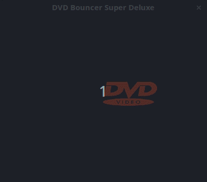

# DVDBounce

Now you can finally have that retro DVD screensaver on your PC.

## Installation

**DVDBounce** is made in C++ with *SFML* using the package manager *Conan* and build tool *CMake*, for ease of compilation I recommend acquiring all of these tools.

1. Acquire a C++ compiler, Conan, and CMake
   1. Configure the *bincrafters* repository with Conan: `conan remote add bincrafters https://api.bintray.com/conan/bincrafters/public-conan`
2. Clone the repo
3. Install dependencies
   1. Create a conan folder in the repo
   2. `cd conan && conan install .. --build missing`
4. compile
   1. Create a build folder
   2. You can run `c.sh` if you're on a unix system otherwise:
      1. `cd build && cmake .. && cmake --build . ** bin/dvdbounce`
      2. Note: It's important that the resources folder is in the same directory as the executable
